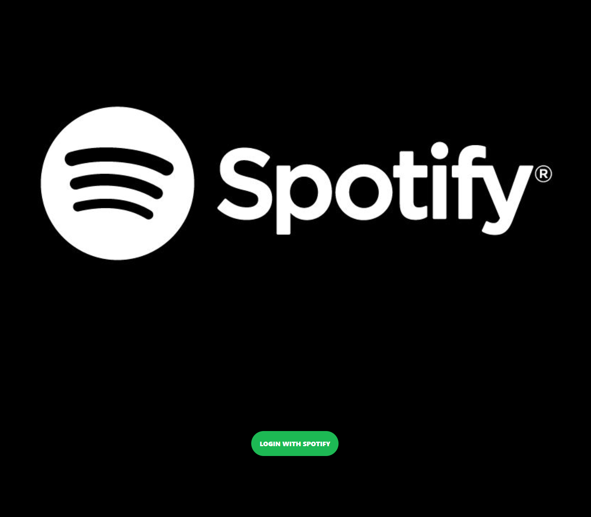
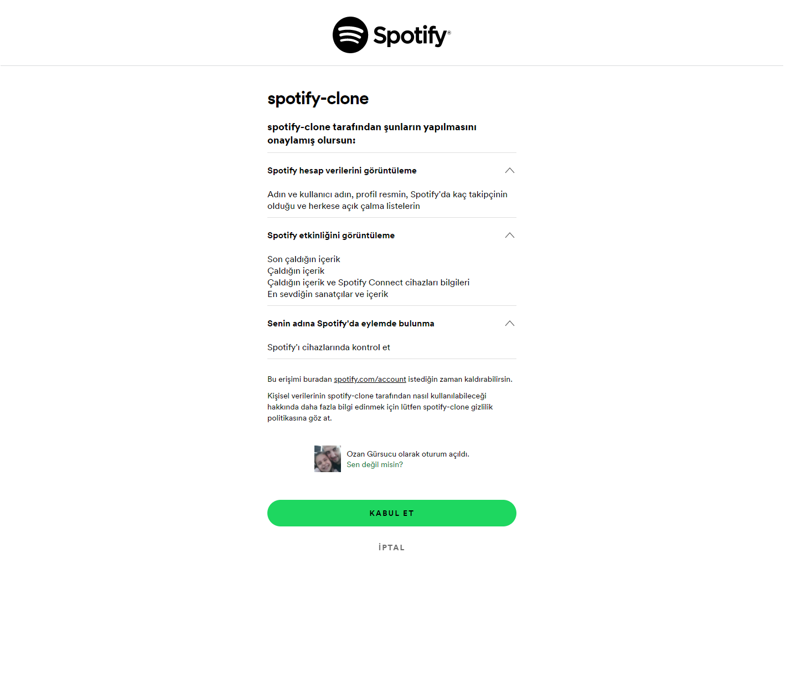
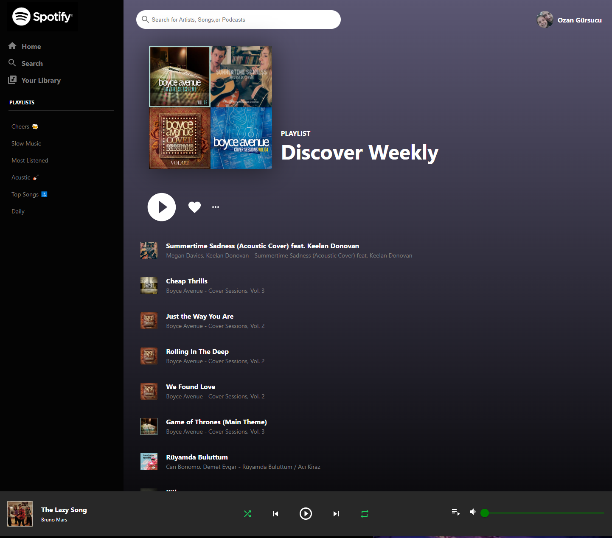

# Spotify-Clone

Click demo to try it by yourself!

You can log in to Spotify-Clone using your username and view your playlists.

## Spotify-Clone Demo Link

You can view the site here
[Click Me](https://spotify-clone-ozngrsc.web.app)

## Topics

- ReactJS
- JavaScript
- User Authentication
- Context API - Redux
- Spotify API
- React Hooks Functional(Hooks, State)
- React Router
- React Icons
- Material UI
- Responsive Design
- Deploy the App Live on Firebase

## Author

Ozan Gürsucu (ozngrsc)

